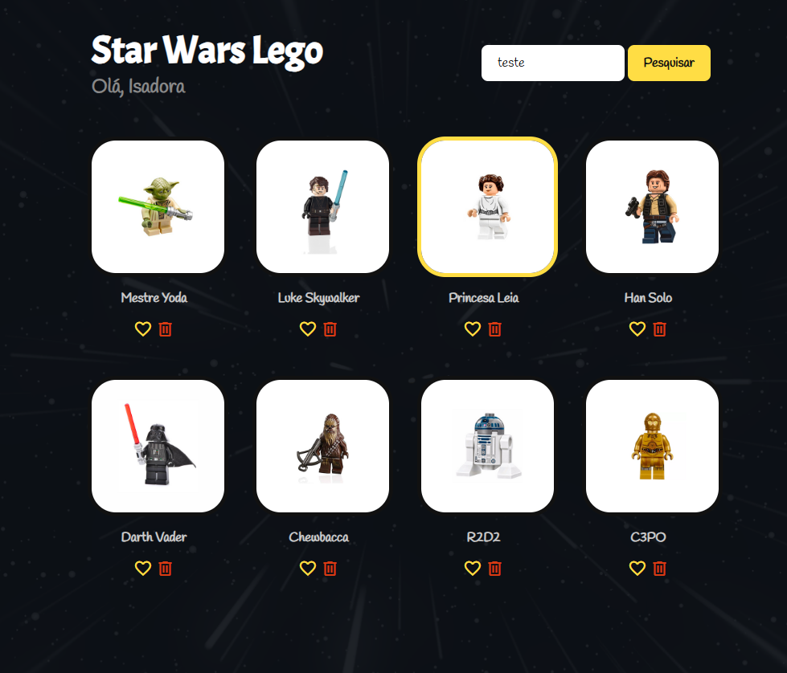
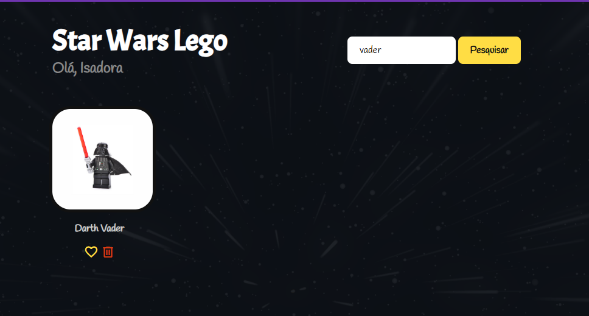
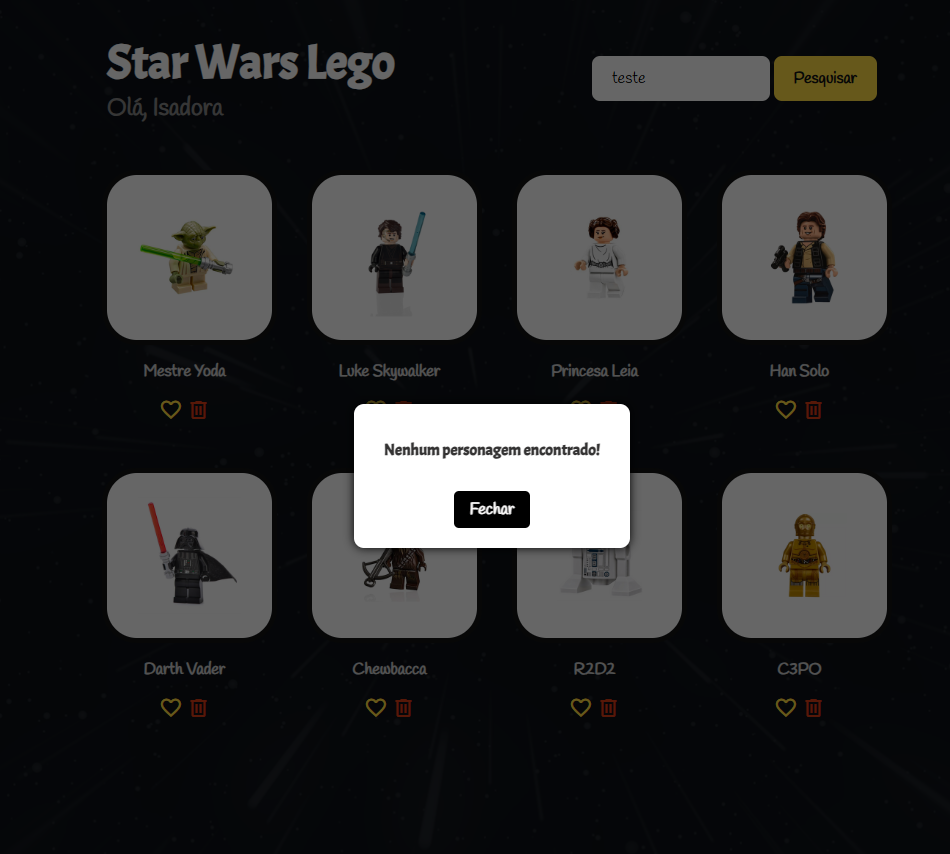

# 🌌 Star Wars Lego

📚 **Curso - Javascript para QAs**  
Este projeto foi desenvolvido como parte do curso **Javascript para QAs**, ministrado por Fernando Papito na Udemy. O objetivo é fortalecer os conceitos fundamentais de **JavaScript**, compreendendo sua aplicação desde o desenvolvimento até a automação de testes.

Para este exercício, criamos uma aplicação web chamada **Star Wars Lego**, que simula uma interface interativa com personagens da saga Star Wars em estilo Lego.

---

## 🚀 Funcionalidades

- Listagem de personagens com imagens em estilo Lego
            
- 🔍 Busca por personagem
            
            
- Interface responsiva
- Código estruturado para facilitar testes automatizados

---

## 🛠️ Tecnologias Utilizadas

- **JavaScript** – Linguagem principal
- **Vue.js** – Framework para construção da interface
- **HTML e CSS** – Estrutura e estilização da página

---

## 📦 Como Executar o Projeto

1. **Clone o repositório**
git clone https://github.com/isadoraada/javascript-para-qas

2. **Acesse a pasta do projeto**
cd star-wars-lego

3. **Instale as dependências**
npm install

4. **Execute o servidor de desenvolvimento**
npm run serve